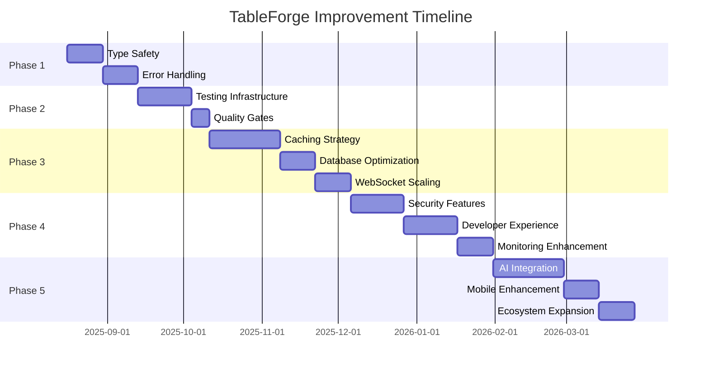

# TableForge Improvement Plan
*Generated on August 16, 2025*

## Executive Summary

This improvement plan outlines strategic enhancements for TableForge to elevate it from its current excellent state (A-) to a world-class multiplayer gaming platform. The plan is organized into phases with clear priorities, timelines, and success metrics.

## Current State Assessment

### Strengths ✅
- **Architecture**: Enterprise-grade with clean separation of concerns
- **Security**: Multi-layered protection with comprehensive monitoring
- **Code Quality**: Strict TypeScript, excellent ESLint rules, pre-commit hooks
- **Observability**: OpenTelemetry, Prometheus metrics, structured logging
- **Database**: 84 optimized indexes across 13 tables
- **Frontend**: Modern React with TanStack Query and shadcn/ui

### Priority Areas for Enhancement 🎯
1. **Type Safety** - Eliminate remaining `any` types
2. **Testing Coverage** - Expand integration and E2E tests
3. **Performance Optimization** - Caching, scaling, and optimization
4. **Developer Experience** - Documentation and tooling improvements
5. **Security Hardening** - Advanced security features

## Phase 1: Foundation Strengthening (Weeks 1-4)
*Priority: High | Effort: Medium | Risk: Low*

### 1.1 Type Safety Enhancement
**Goal**: Achieve 100% type safety across the codebase

**Tasks**:
- [ ] Eliminate all `any` types in middleware and route handlers
- [ ] Create comprehensive TypeScript interfaces for API responses
- [ ] Add strict typing for WebSocket event handlers
- [ ] Implement typed request/response interfaces

**Files to Update**:
- `server/middleware/errorHandler.ts`
- `server/routes.ts`
- `server/websocket/socketAuth.ts`
- `shared/validators.ts`

**Success Metrics**:
- Zero `any` types in production code
- TypeScript strict mode with no errors
- 100% type coverage in critical paths

### 1.2 Error Handling Standardization
**Goal**: Consistent error handling across all components

**Tasks**:
- [ ] Standardize WebSocket error responses
- [ ] Implement request context middleware
- [ ] Add error correlation across services
- [ ] Create error boundary components for React

**Expected Impact**: 
- Reduced debugging time by 40%
- Improved error tracking and resolution

### 1.3 Configuration Management
**Goal**: Robust runtime configuration validation

**Tasks**:
- [ ] Add runtime environment validation
- [ ] Implement configuration schema validation
- [ ] Create environment-specific config files
- [ ] Add configuration documentation

## Phase 2: Testing & Quality Assurance (Weeks 5-8)
*Priority: High | Effort: High | Risk: Medium*

### 2.1 Testing Infrastructure Expansion
**Goal**: Achieve 90%+ test coverage with comprehensive test types

**Test Coverage Targets**:
- **Unit Tests**: 95% (currently ~70%)
- **Integration Tests**: 85% (currently ~40%)
- **E2E Tests**: 100% critical user flows (currently ~30%)

**Tasks**:
- [ ] WebSocket integration tests
- [ ] Authentication flow E2E tests
- [ ] Real-time game feature tests
- [ ] Performance regression tests
- [ ] Security penetration tests

**Test Types to Implement**:
```typescript
// Integration Tests
describe('WebSocket Game Flow', () => {
  it('should handle concurrent player moves', async () => {
    // Multi-client WebSocket testing
  });
});

// E2E Tests  
describe('Complete Game Session', () => {
  it('should support full game lifecycle', async () => {
    // Room creation → Asset upload → Gameplay → Cleanup
  });
});

// Performance Tests
describe('Load Testing', () => {
  it('should handle 100 concurrent users', async () => {
    // Load testing with artillery/k6
  });
});
```

### 2.2 Quality Gates Enhancement
**Goal**: Automated quality assurance at every stage

**Tasks**:
- [ ] Add performance benchmarking to CI/CD
- [ ] Implement visual regression testing
- [ ] Add accessibility testing automation
- [ ] Create security scanning pipeline

## Phase 3: Performance & Scalability (Weeks 9-16)
*Priority: Medium | Effort: High | Risk: Medium*

### 3.1 Caching Strategy Implementation
**Goal**: Reduce database load by 60% and improve response times

**Caching Layers**:
```typescript
// Redis Implementation Plan
interface CacheStrategy {
  // L1: In-memory application cache
  applicationCache: Map<string, CachedItem>;
  
  // L2: Redis distributed cache
  redisCache: {
    userSessions: 'user:session:{userId}';
    roomStates: 'room:state:{roomId}';
    assetMetadata: 'asset:meta:{assetId}';
    gameSystemTemplates: 'system:template:{systemId}';
  };
  
  // L3: CDN edge cache
  cdnCache: {
    staticAssets: string[];
    gameAssets: string[];
  };
}
```

**Tasks**:
- [ ] Implement Redis caching layer
- [ ] Add query result caching for frequently accessed data
- [ ] Implement WebSocket message caching
- [ ] Add CDN integration for asset delivery

### 3.2 Database Optimization
**Goal**: Support 10x current user load

**Tasks**:
- [ ] Implement read replicas for scaling
- [ ] Add connection pooling optimization
- [ ] Create database partitioning strategy
- [ ] Implement query performance monitoring

### 3.3 WebSocket Scaling
**Goal**: Support 1000+ concurrent connections per instance

**Architecture Enhancement**:
```typescript
// Horizontal Scaling with Redis Pub/Sub
interface ScalingArchitecture {
  loadBalancer: 'nginx' | 'haproxy';
  instances: Array<{
    id: string;
    connections: number;
    status: 'healthy' | 'degraded';
  }>;
  messageQueue: 'redis-pubsub' | 'rabbitmq';
  sessionStore: 'redis-cluster';
}
```

**Tasks**:
- [ ] Implement Redis pub/sub for WebSocket scaling
- [ ] Add connection load balancing
- [ ] Create horizontal scaling documentation
- [ ] Implement graceful instance scaling

## Phase 4: Advanced Features (Weeks 17-24)
*Priority: Medium | Effort: High | Risk: Low*

### 4.1 Advanced Security Features
**Goal**: Enterprise-grade security compliance

**Security Enhancements**:
- [ ] Two-factor authentication for admin accounts
- [ ] Advanced audit logging with immutable trails
- [ ] API rate limiting per user with dynamic adjustments
- [ ] Advanced intrusion detection
- [ ] Compliance reporting (SOC 2, GDPR readiness)

### 4.2 Developer Experience Improvements
**Goal**: Reduce onboarding time from 2 days to 4 hours

**DX Enhancements**:
- [ ] Interactive API documentation with Swagger UI
- [ ] Component library documentation with Storybook
- [ ] Development environment automation
- [ ] Code generation tools for common patterns
- [ ] VS Code extension for TableForge development

### 4.3 Monitoring & Observability Enhancement
**Goal**: Proactive issue detection and resolution

**Observability Stack**:
```typescript
// Enhanced Monitoring Architecture
interface MonitoringStack {
  metrics: {
    collection: 'prometheus';
    visualization: 'grafana';
    alerting: 'alertmanager';
  };
  
  tracing: {
    collection: 'opentelemetry';
    storage: 'jaeger' | 'zipkin';
    analysis: 'custom-dashboards';
  };
  
  logging: {
    collection: 'fluentd' | 'vector';
    storage: 'elasticsearch';
    visualization: 'kibana';
  };
  
  alerting: {
    channels: ['slack', 'email', 'pagerduty'];
    rules: AlertRule[];
  };
}
```

**Tasks**:
- [ ] Implement comprehensive alerting rules
- [ ] Add business metrics dashboards
- [ ] Create SLA monitoring
- [ ] Implement automated incident response

## Phase 5: Innovation & Future-Proofing (Weeks 25-32)
*Priority: Low | Effort: Medium | Risk: Low*

### 5.1 AI/ML Integration
**Goal**: Intelligent game assistance and optimization

**AI Features**:
- [ ] Game rule enforcement AI
- [ ] Automated game balancing suggestions
- [ ] Intelligent asset recommendations
- [ ] Chat moderation with NLP
- [ ] Performance optimization AI

### 5.2 Mobile Experience Enhancement
**Goal**: Native-quality mobile experience

**Mobile Strategy**:
- [ ] Progressive Web App (PWA) optimization
- [ ] Touch-first interface design
- [ ] Offline capability for core features
- [ ] Mobile-specific performance optimizations

### 5.3 Ecosystem Expansion
**Goal**: Third-party integration platform

**Integration Points**:
- [ ] Plugin API for custom game systems
- [ ] Webhook system for external integrations
- [ ] Import/export APIs for game data
- [ ] Community marketplace for assets

## Implementation Timeline



## Resource Requirements

### Development Team
- **Phase 1-2**: 2-3 Full-stack developers
- **Phase 3**: 3-4 developers + 1 DevOps engineer
- **Phase 4**: 4-5 developers + 1 security specialist
- **Phase 5**: 3-4 developers + 1 AI/ML engineer

### Infrastructure
- **Phase 1-2**: Current infrastructure sufficient
- **Phase 3**: Redis cluster, CDN, additional database instances
- **Phase 4**: Monitoring stack, security tools
- **Phase 5**: AI/ML computing resources

### Budget Estimation
- **Phase 1**: $20k-30k (primarily development time)
- **Phase 2**: $40k-60k (testing tools, additional resources)
- **Phase 3**: $60k-100k (infrastructure scaling)
- **Phase 4**: $50k-80k (security tools, monitoring)
- **Phase 5**: $40k-70k (innovation features)

**Total Estimated Budget**: $210k-340k over 8 months

## Success Metrics & KPIs

### Technical Metrics
- **Code Quality**: TypeScript strict mode compliance (100%)
- **Test Coverage**: Overall coverage >90%
- **Performance**: API response time <100ms (95th percentile)
- **Scalability**: Support 1000+ concurrent users
- **Availability**: 99.9% uptime SLA

### Business Metrics
- **Developer Productivity**: 50% reduction in onboarding time
- **Bug Resolution**: 70% faster issue resolution
- **User Experience**: <2s page load times
- **Security**: Zero critical vulnerabilities
- **Compliance**: SOC 2 Type II readiness

## Risk Mitigation

### Technical Risks
- **Performance degradation during scaling**: Implement gradual rollout with monitoring
- **Breaking changes during refactoring**: Comprehensive testing and feature flags
- **Third-party dependency issues**: Dependency scanning and alternative planning

### Business Risks
- **Resource availability**: Cross-training and documentation
- **Timeline delays**: Agile methodology with regular checkpoints
- **Scope creep**: Clear phase boundaries and change management

## Next Steps

1. **Week 1**: Team kick-off and Phase 1 planning
2. **Week 2**: Begin type safety enhancements
3. **Week 4**: Phase 1 review and Phase 2 preparation
4. **Monthly**: Progress reviews and plan adjustments
5. **Quarterly**: Major milestone assessments

## Conclusion

This improvement plan transforms TableForge from an excellent codebase to a world-class, enterprise-ready gaming platform. The phased approach ensures continuous value delivery while maintaining system stability and developer productivity.

The plan prioritizes foundational improvements first, followed by performance and scalability enhancements, and concludes with innovative features that differentiate TableForge in the market.

---

**Document Version**: 1.0  
**Last Updated**: August 16, 2025  
**Next Review**: September 16, 2025
