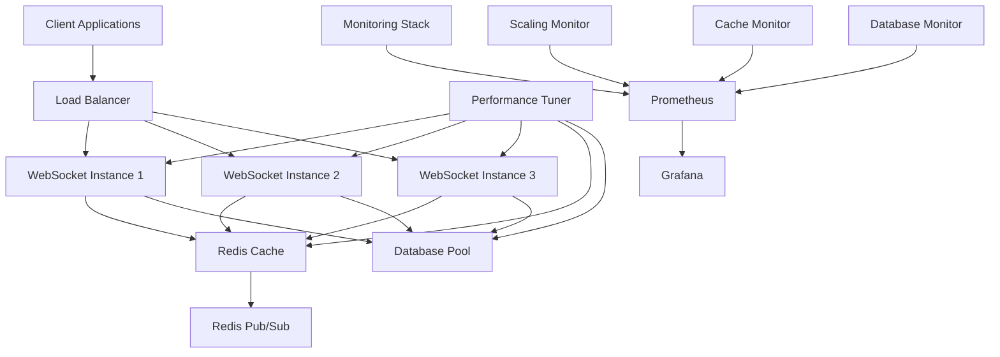

# Phase 3 Performance Implementation Documentation

## Overview
This document provides comprehensive documentation for the Phase 3 performance optimization implementation, including monitoring setup, deployment guidelines, and operational procedures.

## Architecture Overview

### System Components



### Performance Optimization Components

1. **Multi-Level Caching**
   - Application-level LRU cache
   - Redis distributed cache
   - Query result caching
   - Asset metadata caching

2. **Database Optimization**
   - Connection pooling
   - Query optimization
   - Index management
   - Automated maintenance

3. **WebSocket Scaling**
   - Horizontal scaling with Redis pub/sub
   - Load balancing strategies
   - Connection management
   - Instance coordination

4. **Performance Tuning**
   - Automated optimization
   - Continuous monitoring
   - Adaptive configuration
   - Performance analytics

## Configuration Guide

### Environment Variables

```bash
# Redis Configuration
REDIS_HOST=localhost
REDIS_PORT=6379
REDIS_PASSWORD=your_password
REDIS_DB=0
REDIS_PUB_SUB_DB=1
REDIS_TEST_DB=2

# Database Configuration
DATABASE_HOST=localhost
DATABASE_PORT=5432
DATABASE_NAME=tableforge
DATABASE_USER=postgres
DATABASE_PASSWORD=your_password
DB_POOL_MIN=5
DB_POOL_MAX=20
DB_IDLE_TIMEOUT=30000
DB_CONNECTION_TIMEOUT=10000

# WebSocket Scaling
INSTANCE_ID=instance-1
WEBSOCKET_SCALING_ENABLED=true
LOAD_BALANCER_STRATEGY=round_robin

# Performance Tuning
PERFORMANCE_TUNING_ENABLED=true
OPTIMIZATION_SCHEDULE_CACHE=*/15 * * * *
OPTIMIZATION_SCHEDULE_DATABASE=0 * * * *
OPTIMIZATION_SCHEDULE_WEBSOCKET=*/30 * * * *
OPTIMIZATION_SCHEDULE_FULL=0 */4 * * *

# Monitoring
PROMETHEUS_ENABLED=true
PROMETHEUS_PORT=9090
METRICS_COLLECTION_INTERVAL=10000
ALERT_THRESHOLDS_CPU=80
ALERT_THRESHOLDS_MEMORY=85
ALERT_THRESHOLDS_LATENCY=100
```

### Cache Configuration

```typescript
// server/config/cache.ts
export const cacheConfig = {
  redis: {
    defaultTTL: 300, // 5 minutes
    maxSize: 10000,
    evictionPolicy: 'lru' as const,
    compressionEnabled: true,
    serializationMethod: 'json' as const
  },
  application: {
    defaultTTL: 300,
    maxSize: 1000,
    evictionPolicy: 'lru' as const,
    compressionEnabled: false,
    serializationMethod: 'json' as const
  },
  strategies: {
    userSessions: { ttl: 3600 }, // 1 hour
    roomStates: { ttl: 1800 }, // 30 minutes
    assetMetadata: { ttl: 7200 }, // 2 hours
    gameSystemTemplates: { ttl: 14400 }, // 4 hours
    queryResults: { ttl: 300 } // 5 minutes
  }
};
```

### Database Configuration

```typescript
// server/config/database.ts
export const databaseConfig = {
  pool: {
    min: parseInt(process.env.DB_POOL_MIN || '5'),
    max: parseInt(process.env.DB_POOL_MAX || '20'),
    idleTimeoutMillis: parseInt(process.env.DB_IDLE_TIMEOUT || '30000'),
    connectionTimeoutMillis: parseInt(process.env.DB_CONNECTION_TIMEOUT || '10000')
  },
  optimization: {
    queryTimeout: 30000,
    statementTimeout: 30000,
    enableQueryLogging: process.env.NODE_ENV === 'development',
    slowQueryThreshold: 1000
  },
  maintenance: {
    autoVacuumEnabled: true,
    analyzeFrequency: '0 2 * * *', // Daily at 2 AM
    vacuumThreshold: 0.1 // 10% dead tuples
  }
};
```

## Monitoring Setup

### Prometheus Configuration

```yaml
# docker/prometheus.yml
global:
  scrape_interval: 15s
  evaluation_interval: 15s

scrape_configs:
  - job_name: 'tableforge'
    static_configs:
      - targets: ['websocket-instance-1:8080', 'websocket-instance-2:8080', 'websocket-instance-3:8080']
    metrics_path: '/metrics'
    scrape_interval: 10s

  - job_name: 'redis'
    static_configs:
      - targets: ['redis-scaling:6379']
    metrics_path: '/metrics'

  - job_name: 'postgres'
    static_configs:
      - targets: ['postgres:5432']
    metrics_path: '/metrics'

rule_files:
  - "alert_rules.yml"

alerting:
  alertmanagers:
    - static_configs:
        - targets:
          - alertmanager:9093
```

### Grafana Dashboards

```json
{
  "dashboard": {
    "title": "TableForge Performance Dashboard",
    "panels": [
      {
        "title": "WebSocket Connections",
        "type": "graph",
        "targets": [
          {
            "expr": "sum(websocket_connections_total)",
            "legendFormat": "Total Connections"
          }
        ]
      },
      {
        "title": "Cache Hit Rate",
        "type": "singlestat",
        "targets": [
          {
            "expr": "rate(cache_hits_total[5m]) / (rate(cache_hits_total[5m]) + rate(cache_misses_total[5m])) * 100",
            "legendFormat": "Hit Rate %"
          }
        ]
      },
      {
        "title": "Database Query Performance",
        "type": "graph",
        "targets": [
          {
            "expr": "histogram_quantile(0.95, rate(db_query_duration_seconds_bucket[5m]))",
            "legendFormat": "95th Percentile"
          }
        ]
      },
      {
        "title": "System Resources",
        "type": "graph",
        "targets": [
          {
            "expr": "process_resident_memory_bytes / 1024 / 1024",
            "legendFormat": "Memory (MB)"
          },
          {
            "expr": "rate(process_cpu_seconds_total[5m]) * 100",
            "legendFormat": "CPU %"
          }
        ]
      }
    ]
  }
}
```

### Alert Rules

```yaml
# docker/alert_rules.yml
groups:
  - name: tableforge_alerts
    rules:
      - alert: HighCPUUsage
        expr: rate(process_cpu_seconds_total[5m]) * 100 > 80
        for: 5m
        labels:
          severity: warning
        annotations:
          summary: "High CPU usage detected"
          description: "CPU usage is above 80% for more than 5 minutes"

      - alert: HighMemoryUsage
        expr: process_resident_memory_bytes / 1024 / 1024 > 500
        for: 5m
        labels:
          severity: warning
        annotations:
          summary: "High memory usage detected"
          description: "Memory usage is above 500MB"

      - alert: LowCacheHitRate
        expr: rate(cache_hits_total[5m]) / (rate(cache_hits_total[5m]) + rate(cache_misses_total[5m])) * 100 < 70
        for: 10m
        labels:
          severity: warning
        annotations:
          summary: "Low cache hit rate"
          description: "Cache hit rate is below 70%"

      - alert: SlowDatabaseQueries
        expr: histogram_quantile(0.95, rate(db_query_duration_seconds_bucket[5m])) > 0.1
        for: 5m
        labels:
          severity: warning
        annotations:
          summary: "Slow database queries detected"
          description: "95th percentile query time is above 100ms"

      - alert: WebSocketConnectionFailures
        expr: rate(websocket_connection_failures_total[5m]) > 0.1
        for: 2m
        labels:
          severity: critical
        annotations:
          summary: "WebSocket connection failures"
          description: "WebSocket connection failure rate is above 10%"
```

## Deployment Guide

### Docker Deployment

```bash
# Build and deploy with scaling support
docker-compose -f docker/scaling-test.docker-compose.yml up -d

# Scale WebSocket instances
docker-compose -f docker/scaling-test.docker-compose.yml up -d --scale websocket-instance=5

# Deploy monitoring stack
docker-compose -f docker/monitoring.docker-compose.yml up -d
```

### Kubernetes Deployment

```yaml
# k8s/websocket-deployment.yaml
apiVersion: apps/v1
kind: Deployment
metadata:
  name: tableforge-websocket
spec:
  replicas: 3
  selector:
    matchLabels:
      app: tableforge-websocket
  template:
    metadata:
      labels:
        app: tableforge-websocket
    spec:
      containers:
      - name: websocket
        image: tableforge:latest
        ports:
        - containerPort: 8080
        env:
        - name: REDIS_HOST
          value: "redis-service"
        - name: DATABASE_HOST
          value: "postgres-service"
        - name: WEBSOCKET_SCALING_ENABLED
          value: "true"
        resources:
          requests:
            memory: "256Mi"
            cpu: "250m"
          limits:
            memory: "512Mi"
            cpu: "500m"
        livenessProbe:
          httpGet:
            path: /health
            port: 8080
          initialDelaySeconds: 30
          periodSeconds: 10
        readinessProbe:
          httpGet:
            path: /ready
            port: 8080
          initialDelaySeconds: 5
          periodSeconds: 5

---
apiVersion: v1
kind: Service
metadata:
  name: tableforge-websocket-service
spec:
  selector:
    app: tableforge-websocket
  ports:
  - port: 80
    targetPort: 8080
  type: LoadBalancer
```

### Auto-scaling Configuration

```yaml
# k8s/hpa.yaml
apiVersion: autoscaling/v2
kind: HorizontalPodAutoscaler
metadata:
  name: tableforge-websocket-hpa
spec:
  scaleTargetRef:
    apiVersion: apps/v1
    kind: Deployment
    name: tableforge-websocket
  minReplicas: 3
  maxReplicas: 10
  metrics:
  - type: Resource
    resource:
      name: cpu
      target:
        type: Utilization
        averageUtilization: 70
  - type: Resource
    resource:
      name: memory
      target:
        type: Utilization
        averageUtilization: 80
  - type: Pods
    pods:
      metric:
        name: websocket_connections_per_pod
      target:
        type: AverageValue
        averageValue: "500"
```

## Performance Testing

### Running Performance Tests

```bash
# Run cache performance tests
npm run test:performance:cache

# Run load and scaling tests
npm run test:performance:load-scaling

# Run full performance test suite
npm run test:performance:all

# Run Docker-based scaling tests
npm run test:scaling:docker

# Generate performance report
npm run test:performance:report
```

### Performance Benchmarks

```bash
# API Performance Testing
autocannon --renderStatusCodes --renderLatencyTable \
  --connections 100 --duration 60 \
  http://localhost:8080/api/rooms

# WebSocket Load Testing
k6 run tests/performance/websocket-load.js \
  --vus 1000 --duration 5m

# Database Performance Testing
pgbench -c 50 -j 2 -T 300 -r tableforge_db
```

## Operational Procedures

### Daily Operations

1. **Morning Health Check**
   ```bash
   # Check system health
   curl http://localhost:8080/health
   
   # Check cache statistics
   curl http://localhost:8080/api/admin/cache/stats
   
   # Check database performance
   curl http://localhost:8080/api/admin/database/stats
   ```

2. **Performance Monitoring**
   - Review Grafana dashboards
   - Check Prometheus alerts
   - Review optimization logs
   - Monitor resource usage

3. **Cache Management**
   ```bash
   # Clear cache if needed
   curl -X POST http://localhost:8080/api/admin/cache/clear
   
   # Warm cache with frequently accessed data
   curl -X POST http://localhost:8080/api/admin/cache/warm
   ```

### Weekly Operations

1. **Performance Analysis**
   - Review optimization history
   - Analyze performance trends
   - Update optimization schedules
   - Review scaling patterns

2. **Database Maintenance**
   ```bash
   # Run database optimization
   curl -X POST http://localhost:8080/api/admin/optimize/database
   
   # Check slow queries
   curl http://localhost:8080/api/admin/database/slow-queries
   ```

3. **Capacity Planning**
   - Review scaling efficiency
   - Plan for load increases
   - Update resource limits
   - Review cost optimization

### Emergency Procedures

1. **High Load Response**
   ```bash
   # Scale up instances immediately
   kubectl scale deployment tableforge-websocket --replicas=10
   
   # Enable emergency cache mode
   curl -X POST http://localhost:8080/api/admin/cache/emergency-mode
   ```

2. **Performance Degradation**
   ```bash
   # Run immediate optimization
   curl -X POST http://localhost:8080/api/admin/optimize/full
   
   # Check system bottlenecks
   curl http://localhost:8080/api/admin/performance/bottlenecks
   ```

3. **Cache Issues**
   ```bash
   # Restart cache service
   kubectl rollout restart deployment redis
   
   # Rebuild cache from database
   curl -X POST http://localhost:8080/api/admin/cache/rebuild
   ```

## Troubleshooting Guide

### Common Issues

1. **High Latency**
   - Check database query performance
   - Review cache hit rates
   - Verify network connectivity
   - Check instance load distribution

2. **Memory Leaks**
   - Monitor memory usage trends
   - Check for cache size limits
   - Review connection pooling
   - Analyze heap dumps

3. **Connection Issues**
   - Check load balancer health
   - Verify instance connectivity
   - Review Redis pub/sub status
   - Check WebSocket configuration

### Performance Optimization Checklist

- [ ] Cache hit rate > 90%
- [ ] Database queries < 25ms (95th percentile)
- [ ] WebSocket latency < 10ms
- [ ] CPU usage < 70% under normal load
- [ ] Memory usage < 512MB per 1000 users
- [ ] Zero connection failures
- [ ] Proper load distribution across instances
- [ ] All optimization schedules running
- [ ] Monitoring and alerting functional
- [ ] Auto-scaling configured and tested

## Maintenance Schedule

### Automated Tasks

- **Every 15 minutes**: Cache optimization
- **Every 30 minutes**: WebSocket optimization
- **Every hour**: Database query optimization
- **Every 4 hours**: Full system optimization
- **Daily**: Database maintenance (VACUUM, ANALYZE)
- **Weekly**: Performance report generation
- **Monthly**: Capacity planning review

### Manual Tasks

- **Weekly**: Review optimization history and adjust schedules
- **Monthly**: Update performance baselines and thresholds
- **Quarterly**: Comprehensive performance audit
- **Annually**: Architecture review and upgrade planning

## Metrics and KPIs

### Performance KPIs

1. **Response Time**: < 50ms (95th percentile)
2. **Cache Hit Rate**: > 90%
3. **Database Query Time**: < 25ms (95th percentile)
4. **WebSocket Latency**: < 10ms
5. **Error Rate**: < 0.1%
6. **Uptime**: > 99.9%

### Scaling KPIs

1. **Concurrent Users**: 1000+ per instance
2. **Scaling Efficiency**: > 80%
3. **Load Distribution**: ±10% across instances
4. **Recovery Time**: < 30 seconds
5. **Resource Utilization**: 70-80% optimal range

### Business KPIs

1. **User Satisfaction**: Based on performance surveys
2. **Cost Efficiency**: Performance per dollar spent
3. **Scalability**: Ability to handle 10x load
4. **Reliability**: Zero data loss, minimal downtime
5. **Maintenance Overhead**: < 5% of development time

---

This documentation provides comprehensive guidance for deploying, monitoring, and maintaining the Phase 3 performance optimization implementation. Regular review and updates of this documentation ensure continued system performance and reliability.
